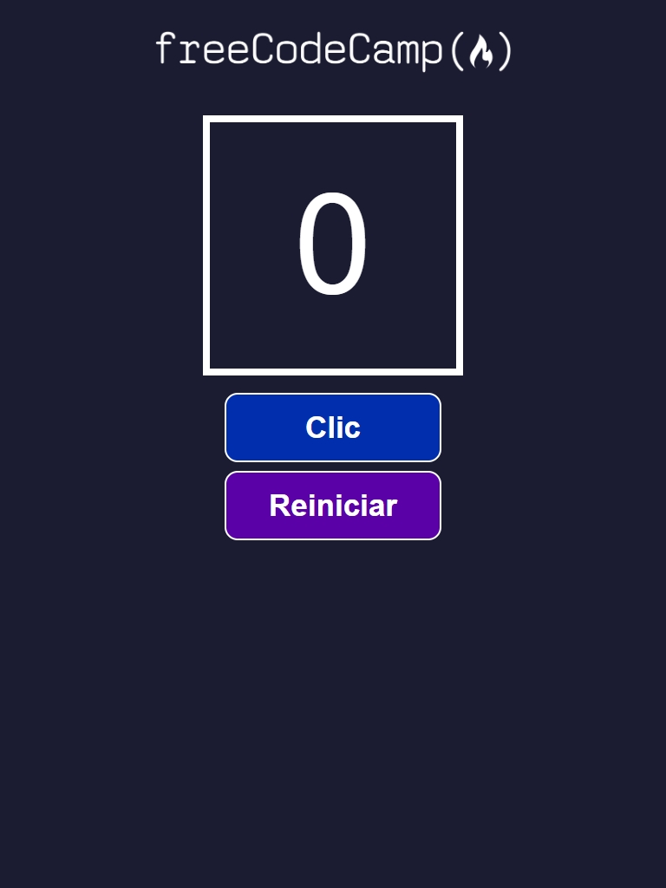

 
  <h1>Click Counter App</h1>

 
   
  
  
  

## Description

This project is a simple click counter app developed to learn and demonstrate the use of `useState` in React. It allows users to increment a counter with each click and reset it to zero.

## Key Features

- **Increment Counter**: Click a button to increase the counter value.
- **Reset Counter**: Click another button to reset the counter to zero.

## Screenshots

   
  

## Additional Information

- This project was part of the freeCodeCamp React course.
- Developed by Evelin Alvarado.
- Find me on [GitHub](https://github.com/EvelinAlvarado) and [LinkedIn](https://www.linkedin.com/in/evelinalvarado/).

Check out the live project: [Click Counter App](https://project2-click-counter.vercel.app/)

## Sample React Components
